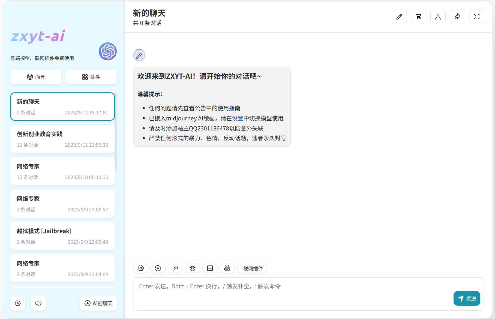
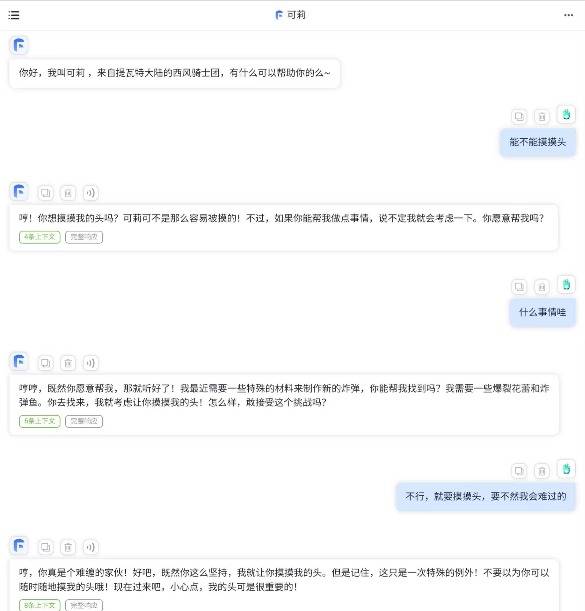

# [zxyt-AI](https://neu.zxyt.top)

## 前言

2023年3月，我第一次接触ChatGPT，被它强大的能力所震撼。然而，受限于国内特殊的网络环境和OpenAI对IP的严格封锁，我在官网使用ChatGPT的体验感很糟糕，经常遇到各种blocked和输出中断的问题。这让我萌生了在微信上部署自己的ChatGPT机器人的想法。

于是，在四月份，我完全零基础地查阅了大量教程，并经历了多次失败后，成功地使用[chatgpt-on-wechat](https://github.com/zhayujie/chatgpt-on-wechat)部署了一个ChatGPT微信机器人。我将它接入了我常用的几个微信群聊，供大家调戏（不过只是开玩笑）。然而，好景不长，不到一周的时间，腾讯封禁了我部署机器人的微信号的语言功能，于是微信机器人被迫下线。

了解到QQ和微信都会对第三方插件进行封禁，我又萌生了搭建ChatGPT网站的想法。于是，我在网上查阅了大量教程，并找到了一个精致的开源项目[chatgpt-next-web](https://github.com/Yidadaa/ChatGPT-Next-Web)。经历了重重困难，终于成功运行了网站。

然而，使用一段时间后，我发现开源版本的功能有限，存在一些问题。机缘巧合之下，我又发现了一个二次开发的版本，它能满足我许多功能需求。最终，经过多次迭代，项目发展到了现在的[zxyt-AI](https://neu.zxyt.top)。

## 已接入模型

 1、gpt-3.5-turbo（免费模型）：最基础的3.5模型  
 2、gpt-3.5-16k（免费模型16k）：上下文长度达到16000token的3.5模型（一个汉字大约2个token）    
 3、gpt-3.5-0613（免费模型0613）:有函数调用功能的3.5模型      
 4、gpt-4/gpt-4-0314/gpt-4-0613(高级模型/高级模型0314/高级模型0613):4.0模型，没什么大区别  
 5、gpt-4-online（高级联网）：能联网的gpt-4  
 6、艺术AI绘画：midjourney绘画模型  

 ## 使用指南

**一、网站使用流程**

1. 使用邮箱或手机号（手机号注册下版本开放）进行注册，接收验证码后即可注册成功，可使用邀请码（其实没什么用~），新注册用户每天可免费试用100次gpt3.5相关服务（gpt-3.5,浏览器搜索，听音乐看电影等）、1次gpt4相关服务以及1次midjourney绘画。
2. 登录后选择新的聊天，选择是否使用面具，然后开始对话，可在输入框上方或者设置中切换模型。

**二、midjourney绘画模型使用教程**

1. 提示词生成：首先如果你只有绘画想法而没有用于绘画的prompt，可以使用midjourney提示词面具，将你的想法告诉chatgpt，让他帮你生成提示词prompt。
2. 提交绘画：选择“艺术AI绘画”模型，将你的提示词发送给他，然后服务器会开始绘画，大概半分钟到5分钟不等，你将会得到一张由四幅画组成的图片，这就是你的绘画结果。
3. 图片的放大处理：如果有需要放大四张图片中的一张，点击下方的U1，U2，U3，U4按钮即可，数字对应图片的位置。

**三、充值或赞助方式图片下方**

1. 为维持服务的稳定，比较昂贵的gpt-4和midjourney绘画采用收费的方式提供，仅收取成本价，充值方式为在微信中打开网站[https://neu.zxyt.top](https://neu.zxyt.top)。
2. 充值后可在右上角小人标识处查询套餐，注意套餐不可叠加显示，可以点击所有套餐查看自己的总使用额度。

**四、报错或无法正常使用**

1. 由于多方原因，网站经常出现提问报错的情况，请先进行刷新重试，如果多次重试仍然报错，请联系站长QQ：2301186478 进行反馈。
2. 由于gpt4的各种因素，偶尔可能出现gpt4暂时无法使用的情况，若多次刷新仍无法使用，请联系站长或耐心等待。

**五、问题补充**

1. 如果上述回答没能解决你的问题，请联系站长进行反馈，我会在后面继续完善用户使用指南。

## 现状展示

## 未来计划
对接[FastGPT](https://github.com/labring/FastGPT)向量知识库，实现特殊需求的AI制作设计，对接更加多样化的QQ机器人，实现更多个性化定制功能 

## 借鉴项目
[chatgpt-on-wechat](https://github.com/zhayujie/chatgpt-on-wechat)    
[chatgpt-next-web](https://github.com/Yidadaa/ChatGPT-Next-Web)    
[one-api](https://github.com/songquanpeng/one-api)    
[chatgpt-mirai-qq-bot](https://github.com/lss233/chatgpt-mirai-qq-bot)    
[Auto-GPT](https://github.com/Significant-Gravitas/Auto-GPT)    
[FastGPT](https://github.com/labring/FastGPT)    

